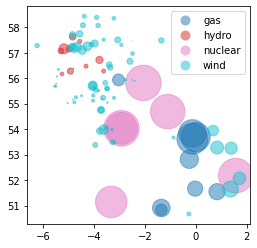

# Map Generation


<br>

### Imports

```python
#exports
import json
import numpy as np
import pandas as pd
import geopandas as gpd

import os
from jinja2 import Template

from ElexonDataPortal import api
```

<br>

### Power Plant Output Data Retrieval

```python
client = api.Client()

client
```


    <ElexonDataPortal.api.Client at 0x174d4565bb0>


```python
df_B1610 = client.get_B1610()

df_B1610.head(3)
```

    B1610: 100%|█████████████████████████████████████████████████████████████████████████████| 4/4 [00:03<00:00,  1.01it/s]
    


|   Unnamed: 0 | documentType      | businessType   | processType   | timeSeriesID          | curveType                   | settlementDate   | powerSystemResourceType   | registeredResourceEICCode   | marketGenerationUnitEICCode   | marketGenerationBMUId   | ...   | nGCBMUnitID   | activeFlag   | documentID              |   documentRevNum | resolution   | start      | end        |   settlementPeriod |   quantity | local_datetime            |
|-------------:|:------------------|:---------------|:--------------|:----------------------|:----------------------------|:-----------------|:--------------------------|:----------------------------|:------------------------------|:------------------------|:------|:--------------|:-------------|:------------------------|-----------------:|:-------------|:-----------|:-----------|-------------------:|-----------:|:--------------------------|
|            0 | Actual generation | Production     | Realised      | ELX-EMFIP-AGOG-TS-280 | Sequential fixed size block | 2020-01-01       | Generation                | 48W00000GORDW-1D            | 48W00000GORDW-1D              | T_GORDW-1               | ...   | GORDW-1       | Y            | ELX-EMFIP-AGOG-22495386 |                1 | PT30M        | 2020-01-01 | 2020-01-01 |                  1 |     24.7   | 2020-01-01 00:00:00+00:00 |
|            1 | Actual generation | Production     | Realised      | ELX-EMFIP-AGOG-TS-241 | Sequential fixed size block | 2020-01-01       | Generation                | 48W00000CRMLW-1E            | 48W00000CRMLW-1E              | T_CRMLW-1               | ...   | CRMLW-1       | Y            | ELX-EMFIP-AGOG-22495386 |                1 | PT30M        | 2020-01-01 | 2020-01-01 |                  1 |     47.498 | 2020-01-01 00:00:00+00:00 |
|            2 | Actual generation | Production     | Realised      | ELX-EMFIP-AGOG-TS-231 | Sequential fixed size block | 2020-01-01       | Generation                | 48W00000BLKWW-1L            | 48W00000BLKWW-1L              | T_BLKWW-1               | ...   | BLKWW-1       | Y            | ELX-EMFIP-AGOG-22495386 |                1 | PT30M        | 2020-01-01 | 2020-01-01 |                  1 |     10.63  | 2020-01-01 00:00:00+00:00 |</div>


<br>

### Location & Fuel Type Data Collation

```python
df_powerdict = pd.read_csv('https://raw.githubusercontent.com/OSUKED/Power-Station-Dictionary/main/data/output/power_stations.csv')

df_powerdict.head(3)
```


|   Unnamed: 0 |   osuked_id | esail_id   | gppd_idnr   | name                 | sett_bmu_id                        |   longitude |   latitude | fuel_type   |   capacity_mw |
|-------------:|------------:|:-----------|:------------|:---------------------|:-----------------------------------|------------:|-----------:|:------------|--------------:|
|            0 |       10000 | MARK       | nan         | Rothes Bio-Plant CHP | E_MARK-1, E_MARK-2                 |    -3.60352 |    57.4804 | biomass     |           nan |
|            1 |       10001 | DIDC       | nan         | Didcot A (G)         | T_DIDC1, T_DIDC2, T_DIDC4, T_DIDC3 |    -1.26757 |    51.6236 | coal        |           nan |
|            2 |       10002 | ABTH       | GBR1000374  | Aberthaw B           | T_ABTH7, T_ABTH8, T_ABTH9          |    -3.40487 |    51.3873 | coal        |          1586 |</div>


```python
osuked_id_to_bmu_ids = (df_powerdict
                        .set_index('osuked_id')
                        ['sett_bmu_id']
                        .str.split(', ')
                        .dropna()
                        .to_dict()
                       )

osuked_id_to_fuel_type = (df_powerdict
                          .set_index('osuked_id')
                          ['fuel_type']
                          .dropna()
                          .to_dict()
                         )

osuked_id_to_name = (df_powerdict
                     .set_index('osuked_id')
                     ['name']
                     .dropna()
                     .to_dict()
                    )

osuked_id_to_lat_lon = (df_powerdict
                        .set_index('osuked_id')
                        [['latitude', 'longitude']]
                        .dropna()
                        .apply(dict, axis=1)
                        .to_dict()
                       )
```

```python
df_B1610_pivot = df_B1610.pivot('local_datetime', 'marketGenerationBMUId', 'quantity').astype(float)

df_B1610_pivot.head(3)
```


| local_datetime            |   2__PMARB001 |   2__PSTAT001 |   2__PSTAT002 |   E_ABRTW-1 |   E_ASHWW-1 |   E_BABAW-1 |   E_BETHW-1 |   E_BNWKW-1 |   E_BRDUW-1 |   E_BRYBW-1 | ...   |   T_WDNSO-2 |   T_WHIHW-1 |   T_WHILW-1 |   T_WHILW-2 |   T_WILCT-1 |   T_WLNYO-2 |   T_WLNYO-3 |   T_WLNYO-4 |   T_WLNYW-1 |   T_WTMSO-1 |
|:--------------------------|--------------:|--------------:|--------------:|------------:|------------:|------------:|------------:|------------:|------------:|------------:|:------|------------:|------------:|------------:|------------:|------------:|------------:|------------:|------------:|------------:|------------:|
| 2020-01-01 00:00:00+00:00 |         8.444 |        27.926 |        18.972 |       9.144 |       4.806 |      17.986 |      25.52  |      13.416 |      27.688 |      46.42  | ...   |      44.548 |      18.564 |       78.99 |      52.374 |       33.33 |       28.96 |     126.22  |      80.802 |       18.06 |     106.282 |
| 2020-01-01 00:30:00+00:00 |         8.56  |        27.504 |        19.15  |       4.994 |       4.168 |      10.69  |      25.088 |      13.968 |      29.432 |      57.706 | ...   |      30.468 |      15.876 |       80.83 |      60.31  |       33.1  |       22.14 |      91.804 |      67.088 |       13.2  |     110.682 |
| 2020-01-01 01:00:00+00:00 |         8.652 |        27.578 |        29.02  |       7.032 |       5.26  |      14.492 |      25.622 |      14.08  |      27.392 |      58.524 | ...   |      19.968 |      12.936 |      102.33 |      59.516 |       33.06 |       13.04 |      58.684 |      56.57  |       11.36 |      94.122 |</div>


```python
flatten_list = lambda list_: [item for sublist in list_ for item in sublist]

bmu_ids_with_metadata = sorted(list(set(flatten_list(osuked_id_to_bmu_ids.values()))))
bmu_ids_with_metadata_and_output = df_B1610_pivot.columns.intersection(bmu_ids_with_metadata)
bmu_ids_without_metadata = sorted(list(set(df_B1610_pivot.columns) -set(bmu_ids_with_metadata)))

pct_site_coverage = len(bmu_ids_with_metadata_and_output)/df_B1610_pivot.columns.size
pct_output_coverage = df_B1610_pivot.sum()[bmu_ids_with_metadata_and_output].sum()/df_B1610_pivot.sum().sum()

print(f"{pct_site_coverage:.0%} of the sites have coverage, making up {pct_output_coverage:.0%} of the total power output. The following are missing:\n{', '.join(bmu_ids_without_metadata)}")
```

    92% of the sites have coverage, making up 95% of the total power output. The following are missing:
    2__PMARB001, E_TLYMW-1, T_ABRBO-1, T_BEATO-1, T_BEATO-2, T_BEATO-3, T_BEATO-4, T_EAAO-1, T_HOWAO-1, T_HOWAO-2, T_HOWAO-3, T_STLGW-3, T_WHIHW-1, T_WILCT-1
    

```python
sites_data = list()

for osuked_id, bmu_ids in osuked_id_to_bmu_ids.items():
    lat_lon_match = osuked_id in osuked_id_to_lat_lon.keys()
    output_match = df_B1610_pivot.columns.intersection(bmu_ids).size == len(bmu_ids)
    
    if lat_lon_match and output_match:
        site_data = osuked_id_to_lat_lon[osuked_id]
        site_data.update({'osuked_id': osuked_id})
        site_data.update({'name': osuked_id_to_name[osuked_id]})
        site_data.update({'fuel_type': osuked_id_to_fuel_type[osuked_id]})
        site_data.update({'output': df_B1610_pivot[bmu_ids].sum(axis=1).iloc[-1]})
        site_data.update({'output_time': df_B1610_pivot[bmu_ids].sum(axis=1).index[-1].strftime('%Y-%m-%d %H:%M')})
    
        sites_data += [site_data]
    
df_map = pd.DataFrame(sites_data).set_index('osuked_id')

df_map.head(3)
```


|   osuked_id |   latitude |   longitude | name           | fuel_type   |   output | output_time      |
|------------:|-----------:|------------:|:---------------|:------------|---------:|:-----------------|
|       10031 |    51.5429 |    0.834961 | Coryton        | gas         |  264.64  | 2020-01-01 01:30 |
|       10036 |    51.6623 |   -0.022763 | Enfield Energy | gas         |  232.416 | 2020-01-01 01:30 |
|       10045 |    50.903  |   -1.35132  | Marchwood      | gas         |  310.2   | 2020-01-01 01:30 |</div>


```python
geometry = gpd.points_from_xy(df_map['longitude'], df_map['latitude'])
gdf_map = gpd.GeoDataFrame(df_map, geometry=geometry)

gdf_map.plot(markersize='output', column='fuel_type', alpha=0.5, legend=True)
```


    <AxesSubplot:>





```python
#exports
def generate_map_js(gdf, js_template_fp='../templates/map.js', js_docs_fp='../docs/map.js'):
    geojson = json.loads(gdf.to_json())

    rendered_map_js = Template(open(js_template_fp).read()).render(
        zoom=5,
        center=[53.96, -3.22],
        geojson_features=str(geojson).replace('None', 'null')
    )

    with open(js_docs_fp, 'w', encoding='utf8') as fp:
        fp.write(rendered_map_js)
        
    return
```

```python
generate_map_js(gdf_map)
```
