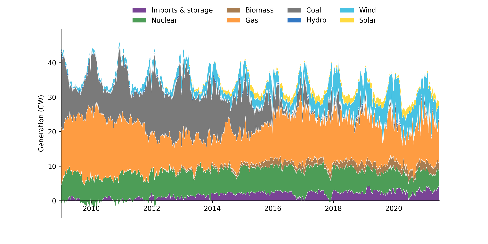
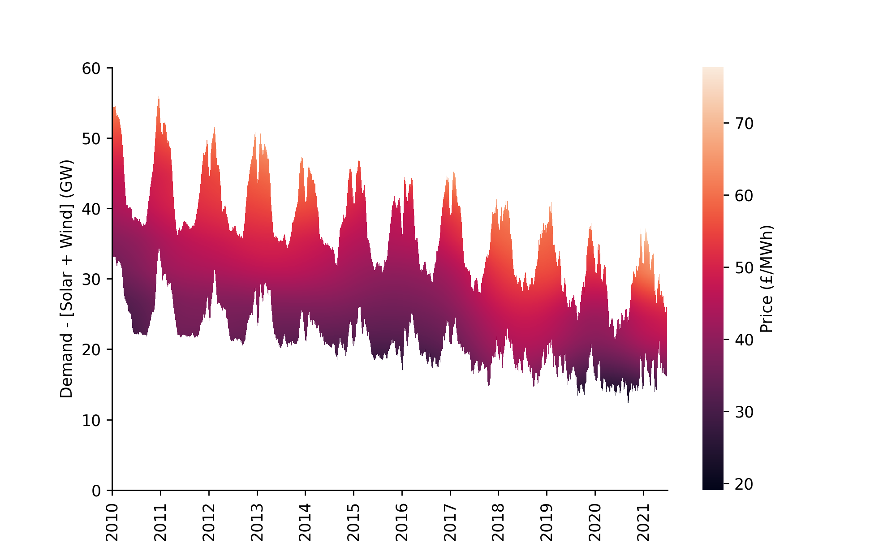
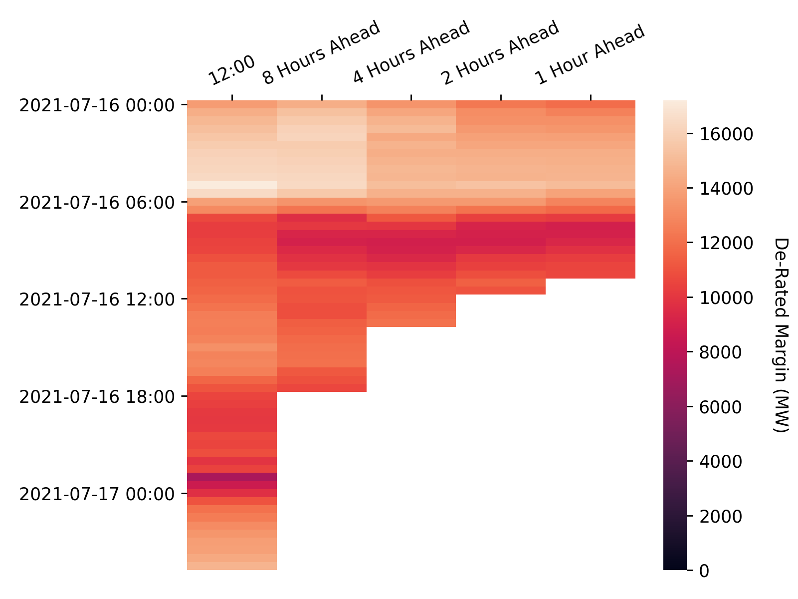
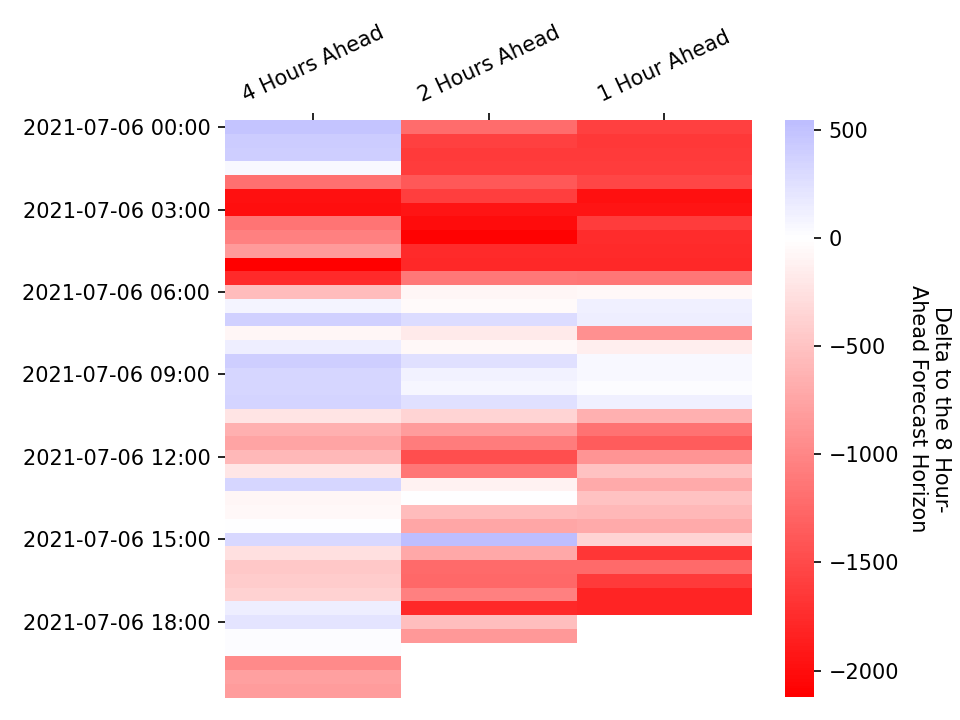

# Visualisations

On this page you can view visualisations of key phenomena in the GB power sector, ranging from long-term trends in the generation-mix and market prices to information on excess capacity in the grid. All data used in these visualisations was either sourced directly from BMRS using the `ElexonDataPortal` client, or has been derived from BMRS data streams. As with the other components of the `ElexonDataPortal` the code to generate these visualisations is open-source and users are welcome to contribute their own visualisations, for more detail on how to do this please refer to the [user contribution guide](#contributor-guide)
    

<br>

### Measuring the Progress and Impacts of Decarbonising British Electricity

The figures shown here are attempts to replicate the visualisations from [this paper](https://www.sciencedirect.com/science/article/pii/S0301421516307017) by Dr Iain Staffell which finds that:

* CO2 emissions from British electricity have fallen 46% in the three years to June 2016.
* Emissions from imports and biomass are not attributed to electricity, but add 5%.
* Coal capacity fell 50% and output 75% due to prices, competition and legislation.
* Wind, solar and biomass provided 20% of demand in 2015, with a peak of 45%.
* Prices have become more volatile and net demand is falling towards must-run nuclear.

These figures will be updated on a weekly basis, the last update was at: 2021-07-05 17:40

<br>

#### Weekly Averaged Generation Mix

The following figure shows a stacked plot of the generation from different fuel types over time, averaged on a weekly basis. The original plot can be found [here](https://www.sciencedirect.com/science/article/pii/S0301421516307017#f0030), the following description is taken directly from the paper.

> Over this period fossil fuels have become increasingly squeezed by the growth of imports, biomass, wind and solar. Coal is seen responding to seasonal changes in demand, and displaced gas over the second half of 2011. Gas generation fell steadily from an average of 17.3 GW in 2009–10 to just 9.3 GW in 2012–13. This trend reversed over the course of 2015 with gas generation rising from an average of 9.0 GW in the first quarter of 2015 to 13.8 GW in the first quarter of 2016. By May 2016 coal generation fell to an average of just 1.1 GW, and on the 10th of May instantaneous coal output fell to zero for the first in over 130 years.




<br>

### Marginal Price Curve Estimation

The figure shown here is reproduced from the work in [this paper](https://ayrtonb.github.io/Merit-Order-Effect/#paper) by Ayrton Bourn which investigates the merit order effect of renewables in the GB and DE power markets in terms of the price and carbon reductions - the key findings are as follows:

* A LOWESS estimation of the non-linear marginal price curve for dispatchable generation shows high back-casting accuracy for Germany and Britain
* The evolving Merit Order Effect (MOE) was estimated through a time-adaptive model, enabling long-term trends to be captured
* In Britain the MOE has increased sharply since 2016, with a 0.67% price reduction per p.p. increase in RES penetration
* Disaggregation of the MOE by fuel-type highlights key differences in the transition paths of Britain and Germany

This figure will be updated on a weekly basis, the last update was at: 2021-07-05 17:40

<br>

#### Smoothed Price Time-Series Surface

This figure shows the LOWESS (Locally Weighted Scatterplot Smoothing) regressions for the day-ahead marginal price curve visualised as a heatmap surface, highlighting the seasonal and non-cyclical changes over time. A mask has been applied where the residual demand after RES is outside the range of 99% of the data. This view is particularly helpful for picking up long-term trends in the market, for example the higher power prices seen in 18/19 due to high gas prices.





<br>

### De-Rated Margin

In each settlement period the system operator publishes the de-rated margin forecast calculated in accordance with the [Loss of Load Probability Calculation Statement](https://www.elexon.co.uk/documents/bsc-codes/lolp/loss-of-load-probability-calculation-statement/) at the following times:

* At 1200 hours on each calendar day for all Settlement Periods for which Gate Closure has not yet passed and which occur within the current Operational Day or the following Operational Day; and
* At eight, four, two and one hour(s) prior to the beginning of the Settlement Period to which the De-Rated Margin Forecast relates.

These figures will be updated on an hourly basis, the last update was at: 2021-07-05 17:45

<br>

#### Forecasts

The following heatmap shows the evolving de-rated margin forecast across the different forecast horizons.



<br>

#### Forecast Deltas

The following heatmap shows how the more recent de-rated margin forecasts deviate from the 8 hours ahead forecast.




<br>

### Power Output Map

Last Updated: 2021-07-05 17:45

This map shows the power output of individual plants connected to the transmission grid as stated in their most recent Physical Notifications. This data can be retrieved through the *PHYBMDATA* BMRS stream, the out-turn data can be viewed one week later through the *B1610* stream. The scrollbar at the top of the map can be used to view how the generation sources have changed their output over the last week, the layer control can be used to toggle on/off the transmission network, and the plants themselves can be clicked to reveal additional information. The plant location data used in this map has been taking from a sister project, [the Power Station Dictionary](https://osuked.github.io/Power-Station-Dictionary/), which aims to link between data about individual power plants.

<div id="map"></div>

<br>

### Contributor Guide

We encourage users to contribute their own visualisations which the `ElexonDataPortal` will then update automatically. To this end the library adopts a standardised format for generating visualisations, the core component of which is the `data/vis_configs.json` file to which you will have to add detail on your visualisation function:

```javascript
[
    ...
    {
        "cron": "0 * * * *", # the update schedule, in this instance to run at midnight every sunday
        "function": "path_to_function", # e.g. ElexonDataPortal.vis.generate_vis
        "kwargs": {
            'api_key': null,  # if no api_key is passed then the client will try and look for the `BMRS_API_KEY` environment variable
            'update_time': null, # if no update_time is passed you should generate it yourself, e.g. with `pd.Timestamp.now().round('5min').strftime('%Y-%m-%d %H:%M')`
            'docs_dir': 'docs', # in almost all circumstances this should just be `docs`
            "optional_kwarg": "optional_value" # you can specify any additional keyword arguments that your function requires
        }
    },
    ...
]
```

<br>

The other core component is writing the function that generates the visualisation. This function should require parameters for the `docs_dir`, `api_key`, and `update_time` but can include optional parameters that you wish to specify, it should then return markdown text which will be used to populate the *Visualisations* page. These functions will normally contain three steps: data retrieval, generating the visualisation, and generating the accompanying text - an example can be seen below.

```python
import pandas as pd
import matplotlib.pyplot as plt
from ..api import Client

def generate_vis(
    docs_dir: str='docs',
    api_key: str=None,
    update_time: str=pd.Timestamp.now().round('5min').strftime('%Y-%m-%d %H:%M'),
) -> str:

    # Data Retrieval
    client = Client(api_key=api_key)
    df = client.get_data_stream(param1, param2)

    # Generating the Visualisation
    fig, ax = plt.subplots(dpi=150)
    df.plot(ax=ax)
    fig.savefig(f'{docs_dir}/img/vis/great_vis_name.png')

    # Generating the Text
    md_text = f"""### Title

Explanation of what your visualisation shows


"""

    return md_text
```

N.b. the path to the image should be relative to the `docs` directory.

If you require any assistance in this process please start a discussion [here](https://github.com/OSUKED/ElexonDataPortal/discussions) and we'll endeavour to help as best we can.
